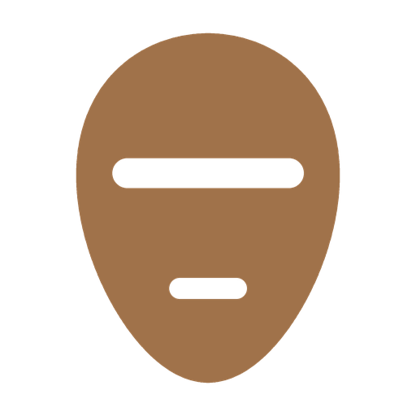

# Mask

Redact text without destroying it. Hide the words, keep the record.

Built for personal use, shared openly, not productised.

---

## What it is

An Obsidian plugin for redaction that does not destroy anything: it hides text behind black bars. Wrap words in `||double pipes||` and they render as a solid bar in Live Preview and Reading view, while the file keeps every word exactly as written. It was made for sharing a screenshot of a journal page without sharing all of it, in a vault where the record is never edited to suit an audience. The other redaction plugins replace the text with block characters, which destroys it. This one only masks the view.

It runs entirely on your machine. There is no network, no account and no data file, and nothing is ever written to a note unless you run the mask command yourself.

> [!NOTE]
> This plugin has not been manually reviewed by Obsidian staff. Read the source before you trust it, it is one short file.

## Features

| Feature | What it does |
|---|---|
| Masks the view, not the file | `\|\|words\|\|` render as a solid bar. The text in the note is untouched. |
| Live Preview and Reading view | Both are masked. Source mode always shows the raw text. |
| Links stay links | A wikilink inside a mask still resolves and still counts in the graph. |
| Edit in place | In Live Preview a mask with the cursor inside shows its raw text. Click away before a screenshot. |
| Show or hide everything | One command, also on the ribbon. It always starts hidden and revealing is never remembered. |
| Mask or unmask a selection | One command, line by line, keeping list, task, heading and quote markers outside the pipes. |
| Leaves the rest alone | Table rows, code, maths, comments and frontmatter are skipped. The pipes must hug the words, like bold, so `\|\| this \|\|` is not a mask. |
| Popout windows | The hidden or revealed state follows every window. |

## Requirements

Obsidian 1.4.0 or newer, desktop or mobile. No build step and no dependencies: the source in this repository is what runs.

## Install

Once it is listed, search for Mask in the community plugin browser. Until then, by hand: download `main.js`, `manifest.json` and `styles.css` from the [latest release](https://github.com/hello-emrah/mask/releases/latest) into `<your vault>/.obsidian/plugins/mask/`, then enable Mask under Settings, Community plugins.

## Use

Select some text and run **Mask or unmask selection** from the command palette, or type the pipes yourself. Run **Show or hide masked text**, or press the eye on the ribbon, to look underneath. Both commands take a hotkey under Settings, Hotkeys. A mask has to open and close inside one block, so an unclosed `||` masks nothing.

## Configuration

There is none, and no environment either. The one choice, hidden or revealed, is deliberately not saved: a note you masked yesterday is masked when you open it today.

## What it is not

Not secrets management. The words are still in the file, in the page and on the clipboard if you copy them out of Reading view, and anyone you send the note to can read them. It masks what is seen on a screen and nothing else.

## Why the name

A mask does not change the face under it. It is put on for the street and taken off at home, and the face is the same face either side. That is the whole behaviour here: the page goes out masked and the record stays as it was written. The seal is a carved face with a single bar where the eyes would be.

## Design philosophy

Built against the visual language of capitalist software design: single shade flat seals in warm earth tones, ancient glyph silhouettes, generous whitespace. No onboarding, no upsell, no telemetry, no account. Built for personal use and shared openly, not productised.

## License

MIT, see [LICENSE](LICENSE).
